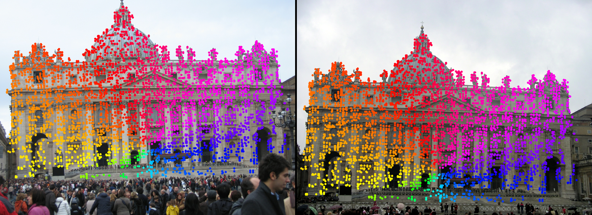

# JamMa: Ultra-lightweight Local Feature Matching with Joint Mamba

[](https://github.com/leoluxxx/JamMa/blob/master/LICENSE)
[](https://arxiv.org/abs/2503.03437)
[](https://leoluxxx.github.io/JamMa-page/)
[](https://github.com/leoluxxx/JamMa)

This is a PyTorch implementation of JamMa for CVPR'25 [paper](https://arxiv.org/abs/2503.03437)  “JamMa: Ultra-lightweight Local Feature Matching with Joint Mamba”.

JamMa is a lightweight image matcher that enables fast internal and mutual interaction of images with joint Mamba.



## Installation
```shell
conda env create -f environment.yaml
conda activate jamma
pip install -r requirements.txt 
pip install mamba-ssm==2.0.3  # require CUDA>11.6, recommend installing from .whl file (way faster)
```
## Demo
We provide a simple demo for matching image pairs and generating visualizations
```shell
cd demo
python demo.py #[--image1 path1 --image2 path2]
```

## Reproduce the testing results
The test and training can be downloaded by [download link](https://drive.google.com/drive/folders/1DOcOPZb3-5cWxLqn256AhwUVjBPifhuf?usp=sharing) provided by LoFTR.

You need to setup the testing subsets of ScanNet and MegaDepth first. We create symlinks from the previously downloaded datasets to `data/{{dataset}}/test`.

```shell
# set up symlinks
ln -s /path/to/scannet-1500-testset/* /path/to/project/data/scannet/test
ln -s /path/to/megadepth-1500-testset/* /path/to/project/data/megadepth/test
```

```shell
bash scripts/reproduce_test/outdoor.sh
```
You should expect the following results
```
{'auc@10': 0.7738815790570285,
 'auc@20': 0.8651362212886763,
 'auc@5': 0.641769096495131,
 'num_matches@1e-04': 4021.4746666666665,
 'prec@1e-04': 0.8891183971633494}
```

## Training on MegaDepth

Please follow the [training doc](docs/TRAINING.md) for data organization

```bash
bash scripts/reproduce_train/outdoor.sh
```

Part of the code is based on the [LoFTR](https://github.com/zju3dv/LoFTR) and [XoFTR](https://github.com/OnderT/XoFTR) repository under their own separate license, terms and conditions. 

We are grateful to the authors for their contribution of the well-structured code.

If you find this project useful, please cite:
```
@misc{lu2025jamma,
    title={JamMa: Ultra-lightweight Local Feature Matching with Joint Mamba},
    author={Xiaoyong Lu and Songlin Du},
    booktitle={Proceedings of the IEEE/CVF Conference on Computer Vision and Pattern Recognition},
    year={2025}
}
```
